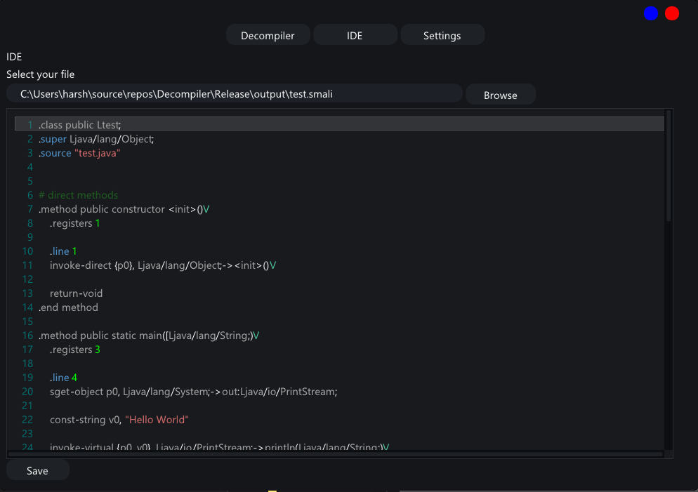

### Decompiler
 This project is based on decompiling file with intregated IDE for editing and compiling the code.
 Whole project is written in C++ and imgui library is used for GUI.

### Supports file types
- [x] .class (Java)
- [x] .dex (Android)
- [x] .apk (Android)
- [ ] .sav (Game Save)
- [ ] more to be added soon

### Requirements
- Clone the repository
- Visual Studio 2019
- Java version >= 22.0.1

### Usage
- Open the project in Visual Studio 2019
- Run the project
- Select the file to decompile
- Edit the code
- Compile the code
- Save the file

### Screenshots

### Future Work
- [ ] Fix Syntax Highlighting
- [ ] Add more file types
- [ ] Improve the GUI
- [ ] Improve the ide

###  Acknowledgements
- [ImGui](https://github.com/ocornut/imgui)
- [ImGuiColorTextEdit](https://github.com/BalazsJako/ImGuiColorTextEdit)
- JadX 
- Baksmali
- Smali
- D8 - DEX Compiler

### Author
- **[Harshit](https://github.com/UxHarshit)**

### Contributing
Pull requests are welcome. For major changes, please open an issue first to discuss what you would like to change.

### License
This project is licensed under the MIT License - see the LICENSE.md file for details.